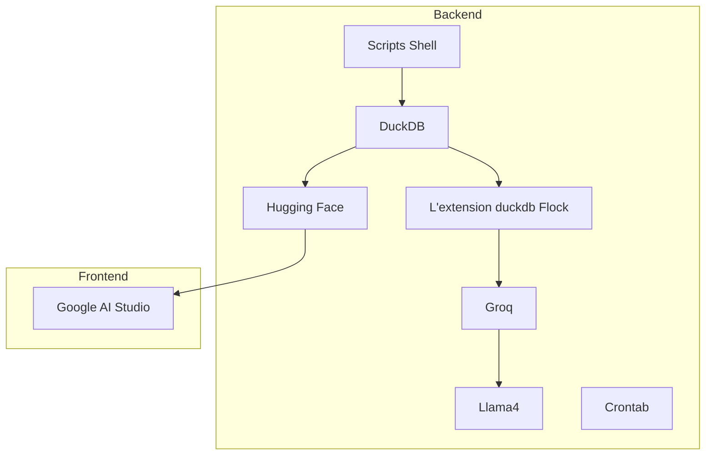
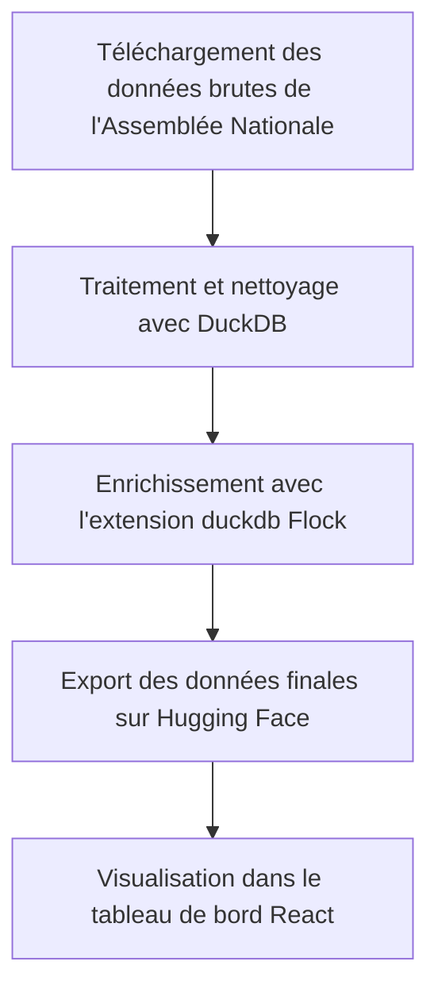

# LawWatch - Suivi des amendements de la Loi de Finances 2026

Ce projet a pour but de suivre et d'analyser les amendements de la Loi de Finances 2026. Il automatise la collecte, le traitement et l'enrichissement des données, et les présente sous forme d'un tableau de bord interactif.

## Stack Technologique



- **Backend**:
  - **Scripts Shell**: Pour l'automatisation du téléchargement des données.
  - **DuckDB**: Pour le traitement et l'analyse des données.
  - **L'extension duckdb Flock**: Pour l'enrichissement des données via un modèle de langage local.
  - **Groq**: Fournisseur d'inférence pour le modèle de langage.
  - **Llama4**: Modèle de langage utilisé pour l'analyse des amendements.
  - **Crontab**: Pour l'historisation des données toutes les 15 minutes.
  - **Hugging Face**: Pour le stockage des données finales.
- **Frontend**:
  - **Google AI Studio**: Pour la génération du code de l'application à partir du jeu de données final.

## Sources des Données

Les données brutes proviennent du site de l'Assemblée Nationale :
- **Suivi des amendements**: `https://data.assemblee-nationale.fr/static/openData/repository/17/dossiers_legislatifs_opendata/52428/libre_office.csv`
- **Liste des députés**: `https://data.assemblee-nationale.fr/static/openData/repository/17/amo/deputes_actifs_csv_opendata/liste_deputes_libre_office.csv`
- **Texte des amendements (JSON)**: Les URLs sont générées dynamiquement à partir des données de suivi.

## Structure du Projet

```
.
├── data/                # Données brutes et traitées
├── src/
│   ├── dao/             # Scripts de téléchargement des données
│   ├── sql/             # Scripts SQL pour le traitement des données
│   └── webapp-client/   # Application frontend React
└── Readme.md
```

## Pipeline de Données

Le pipeline de données est orchestré par les scripts shell et SQL. Voici un aperçu du flux de données :



1.  **Téléchargement des données**: Les scripts `download_data.sh` et `download_amendments.sh` téléchargent les données depuis le site de l'Assemblée Nationale.
2.  **Traitement et nettoyage**: Le script `01_LOAD_CLEAN.sql` charge les données dans DuckDB, les nettoie et les agrège.
3.  **Enrichissement IA**: Le script `02_LLM_COMPLETE.sql` utilise l'extension duckdb Flock pour analyser le texte des amendements et générer des informations supplémentaires (résumé, thème, etc.).
4.  **Export des données**: Le script `03_EXPOSED_DATA.sql` exporte les données enrichies aux formats CSV, Parquet et JSON. Ces données sont ensuite hébergées sur Hugging Face.

## Enrichissement IA

L'enrichissement des données est réalisé via l'extension `Flock` pour DuckDB, qui appelle le modèle `meta-llama/llama-4-maverick-17b-128e-instruct` à travers le fournisseur d'inférence `Groq`.

Le prompt suivant est utilisé pour analyser chaque amendement :

```sql
CREATE PROMPT('analyse_amendement', 
'Instruction : Pour chaque amendement soumis, générer un objet JSON unique contenant les champs suivants.
**Structure JSON requise :**
```json
{
  "resume_mesure": "string",
  "constructivite": "boolean",
  "realisme": "boolean",
  "impact_financier": "enum(positif, negatif)",
  "acteur_gagnant": "string",
  "acteur_perdant": "string",
  "type_mesure": "string",
  "sensibilite": "enum(Gauche, Droite)",
  "type_politique": "string",
  "theme": "string"
}
```
**Description des champs :**
  * **resume\_mesure** : Synthèse concise EN 10 mots max commençant à l infinitif de la mesure proposée.
  * **constructivite** : `true` si l amendement constitue une proposition de fond, `false` s il relève de l obstruction.
  * **realisme** : `true` si l amendement est proportionné et démontre une recherche de compromis.
  * **impact\_financier** : `positif` pour un gain de recettes, `negatif` pour une augmentation des dépenses.
  * **acteur\_gagnant** : Identification du bénéficiaire principal de la mesure.
  * **acteur\_perdant** : Identification de l entité principalement impactée négativement.
  * **type\_mesure** : Qualification de la nature de la mesure (3 mots maximum).
  * **sensibilite** : `Gauche` ou `Droite`.
  * **type\_politique** : Qualification idéologique ou sectorielle de la mesure.
  * **thème** : Renseigné par l objet fiscal, ou le dispositif principal concerné lorsqu il y en a un.'
);
```

## Frontend

L'application frontend, développée avec React et TypeScript, offre un tableau de bord interactif pour explorer les données. Le code de l'application est généré par Google AI Studio à partir du jeu de données final hébergé sur Hugging Face : [alihmaou/plf2026_amendements](https://huggingface.co/datasets/alihmaou/plf2026_amendements).

Le tableau de bord propose :
- Des indicateurs clés (KPIs) sur le nombre d'amendements, leur statut, etc.
- Des graphiques sur la répartition des amendements par groupe politique, par thème, etc.
- Une liste filtrable et paginée des amendements.

## Comment lancer le projet

1.  **Installer les dépendances**:
    ```bash
    pip install -r requirements.txt
    cd src/webapp-client
    npm install
    ```
2.  **Lancer le pipeline de données**:
    ```bash
    ./src/dao/download_data.sh
    duckdb -c ".read src/sql/01_LOAD_CLEAN.sql"
    ./src/dao/download_amendments.sh
    duckdb -c ".read src/sql/02_LLM_COMPLETE.sql"
    duckdb -c ".read src/sql/03_EXPOSED_DATA.sql"
    ```
3.  **Lancer l'application frontend**:
    ```bash
    cd src/webapp-client
    npm run dev
